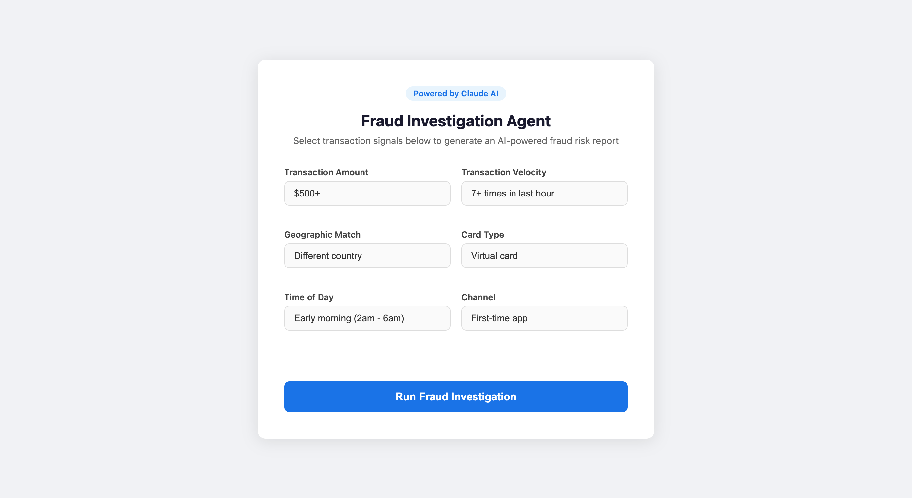
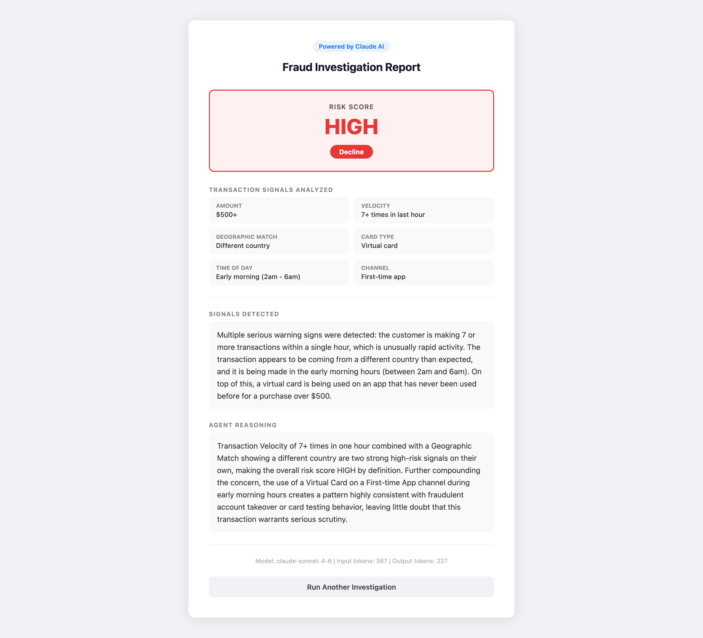

# Fraud Investigation Agent

An AI-powered fraud risk analysis agent built with Spring Boot and Claude (Anthropic API).

## Live Demo

https://fraud-investigation-agent.onrender.com

## What It Does

Select six transaction signals and the agent autonomously analyzes them, weighs them
against each other, and produces a structured fraud investigation report with:

- Risk Score: HIGH / MEDIUM / LOW
- Plain English explanation of detected signals
- Agent reasoning across all six signals
- Recommended action: Approve, Decline, or Flag for Manual Review

## Transaction Signals Analyzed

1. Transaction Amount
2. Transaction Velocity
3. Geographic Match
4. Card Type
5. Time of Day
6. Channel

## How It Works

User submits 6 signals via form
        ↓
FraudController receives input
        ↓
FraudInvestigationService loads prompts from resources/prompts/
        ↓
ClaudeApiClient sends structured prompt to Anthropic API
        ↓
Claude reasons through all 6 signals and returns structured JSON
        ↓
Report rendered: Risk Score + Signals + Reasoning + Recommended Action

## Prompt Engineering Design

- System prompt and user prompt template are externalized to src/main/resources/prompts/
  so they can be updated without a code change
- System prompt enforces strict JSON output contract with explicit fraud analysis rules
- User prompt template uses placeholder substitution for the 6 signal values
- JSON response is parsed into a structured report object with fallback error handling

## Tech Stack

- Java 17
- Spring Boot 3.5
- Thymeleaf
- Anthropic Claude API (claude-sonnet-4-6)
- Docker
- Render (hosting)

## Local Setup

1. Clone the repo
2. Set environment variable: ANTHROPIC_API_KEY=sk-ant-...
3. Run: ./mvnw spring-boot:run
4. Open: http://localhost:8080

## Author

Shruti Vargantwar
Senior Full Stack Java Engineer

## Screenshots

### Input Form

### Fraud Investigation Report

